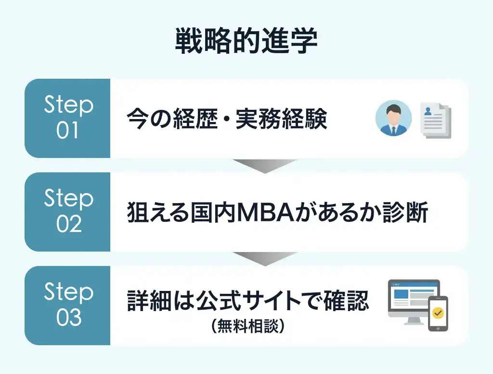

## 現場では誰よりも成果を出している。 なのに、書類選考という壁がある。

現場での実績には自信がある。 

しかし、転職市場では「学歴という評価基準」という冷徹な壁が存在します。

## 学問としてのMBAではない。 「キャリアのタグ」を書き換えるためのMBA。

必要なのは、「難関MBAホルダー」という社会的信用（タグ）と、それを手に入れるための「合格」という事実だけです。

そんなあなたに提案したいのが、社会人専門の進学支援サービス「MBAロンダリング」です。

  <a href="/link/mba-laundering/" class="text-blue-600 underline font-bold hover:text-blue-800">
    >> 職歴ベースで、狙える国内MBAを無料で確認
  </a>

## 「35歳」は限界ではない。キャリアの分岐点だ。

このまま今の延長線上で働き続けるか。 
それとも、3ヶ月間の投資で「MBAホルダー」としての新しいキャリアチケットを手に入れるか。

まずは、あなたの現在のキャリアが、どの大学院であれば高く評価されるのか。 
あなたが今狙える国内MBAを、無料で相談できます。