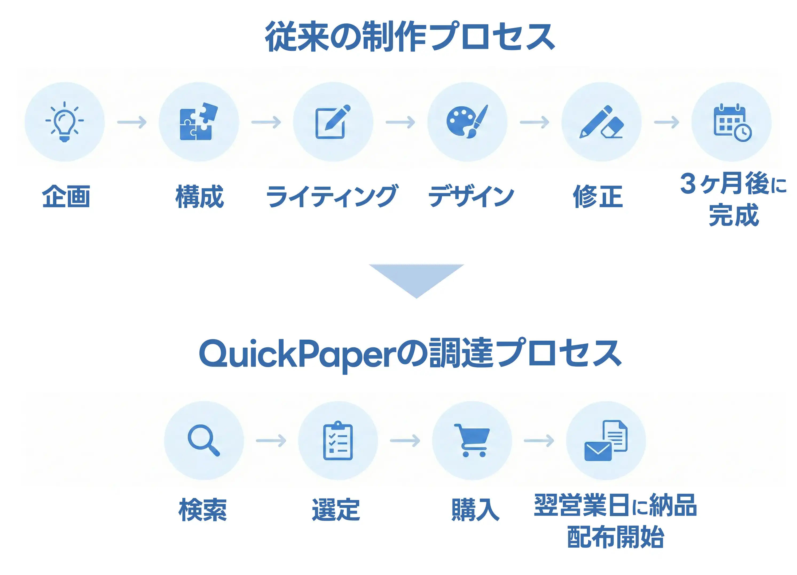

## なぜ、ホワイトペーパー施策は「重い」のか。

「リード獲得にはホワイトペーパーが必須」。

B2Bマーケターなら誰もが理解しているこの事実の裏には、無視できない3つのコストが存在します。

* コスト: 1本あたり25〜50万円の高額な外注費
* 時間: 企画から納品まで2〜4ヶ月のリードタイム
* リスク: 時間とお金をかけても「リードが獲れるか不明」な品質リスク

競合他社が次々と施策を打つ中、制作だけに数ヶ月を費やす余裕は、今の市場にはありません。

「作りたくても、作れない」。

そんなジレンマを抱えていませんか？

  <a href="link/quickpaper/" class="text-primary font-bold underline underline-offset-4 decoration-primary/40 hover:decoration-primary transition-all">
    >> 制作コストと時間を大幅に削減する「QuickPaper」の詳細を見る
  </a>

## 「制作」から「調達」へ。QuickPaperが変える当たり前。

QuickPaper（クイックペーパー）は、ホワイトペーパーを「ゼロから作るもの」から「完成品を選んで買うもの」へと再定義しました。

### 1. 圧倒的なスピードとコストパフォーマンス

完成された資料を購入するため、納品は決済完了の*翌営業日*です。
価格は一律49,800円と、一般的な制作相場と比較して大幅な低コストで導入可能です。稟議を通しやすい価格設定で、スモールスタートを支援します。

### 2. 「被り」を防ぐ1社限定販売

「他社と同じ資料になったらどうする？」という懸念は不要です。
QuickPaperは、同一タイトルを*1社限定*で販売します。購入されたタイトルは即座に市場から消えるため、貴社だけの独自資産として運用可能です。

### 3. PowerPoint形式で「自社化」が自由自在

納品物は編集不可のPDFではなく、*編集可能*なPowerPointファイル（.pptx）です。
自社のロゴ挿入、配色の変更はもちろん、独自の事例スライドを追加することで、汎用的な資料を「貴社独自の営業資料」へと昇華させることができます。

## 1,000以上の「プロ品質」タイトル在庫

2026年1月時点で、13カテゴリ・1,000タイトル以上をラインナップ。
特にSaaS、HRテック、フィンテックなど、競争の激しいB2B領域のタイトルが充実しています。

主なカテゴリ例：
* バーティカルSaaS (120タイトル): 建設、医療、不動産DXなど
* HRテック (107タイトル): 採用、エンゲージメント、労務管理
* セールス・マーケティング (168タイトル): MA活用、インサイドセールス、SFA定着

  <a href="link/quickpaper/" class="text-primary font-bold underline underline-offset-4 decoration-primary/40 hover:decoration-primary transition-all text-xl">
    >> 今すぐ自社領域のタイトル在庫を確認する
  </a>
  
※登録不要で構成案をプレビューできます

## 「中身が見えない」不安を解消

B2Bの実務に耐えうる品質か？

その不安を払拭するため、QuickPaperでは購入前に「構成案（アウトライン）」と「切り口」をすべて確認可能です。

メールアドレスの登録すら不要で、ミスマッチのリスクを極限までゼロに近づけています。

## 機会損失を防ぎ、成果を最大化する。

競合が数ヶ月かけて資料を作っている間に、貴社は明日からリード獲得を開始できます。
スピードは、マーケティングにおける最大の武器です。

まずは、貴社の課題を解決するホワイトペーパーが「在庫」にあるか、確認してください。人気のあるタイトルは、早い者勝ちです。
